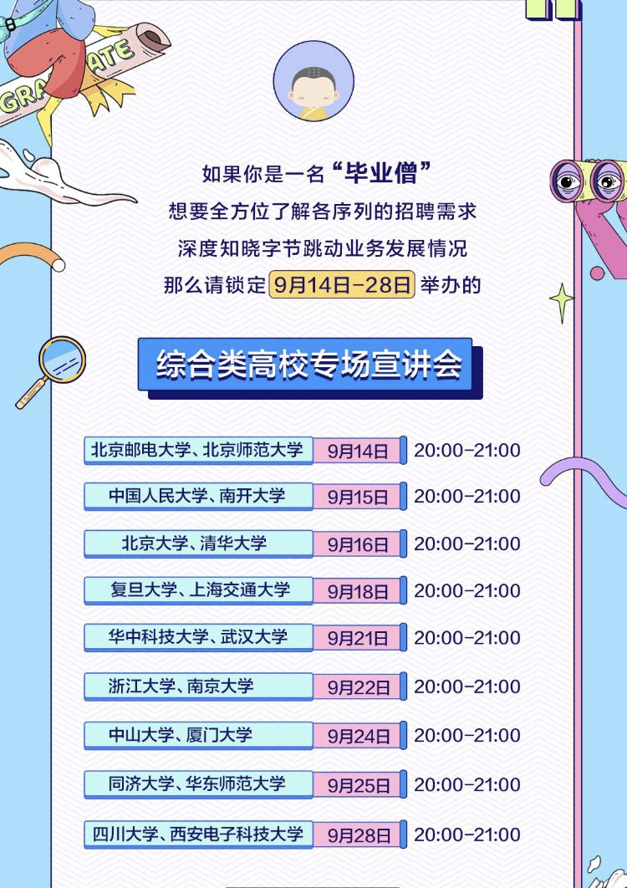

# 字节跳动喊你参加秋招啦！

- Bytedance 2021秋季校招简历投递将持续到**10月31日**，对研发岗位感兴趣的同学可使用研发团队内推码进行投递，可拥有简历优先筛选权哦~

- 这里有今日头条、西瓜视频、国际化、皮皮虾、教育、安全、游戏、用户增长、基础架构等等多个业务线、多种研发岗位机会任你挑选。欢迎大家转发内推码给朋友们～

- 【岗位类型】：前端/后端/测开/算法/大数据/客户端/多媒体/安全/H5游戏/安全研究/C++客户端等  
- 【Base 地点】：北京 / 深圳 / 上海 / 南京 / 杭州 /广州 / 成都 / 厦门  

- 字节跳动内推码: <kbd>WBGJATG</kbd> （可用于所有岗位类型/Base地点）

- 推荐校招岗位：（内推人在这里等你加入，如链接无法打开，请复制到浏览器或使用PC打开）
  - 客户端开发工程师-今日头条/西瓜视频/内容生态：https://job.bytedance.com/campus/position/detail/6852624332289018119?referral_code=WBGJATG
  - 其他推荐-今日头条/西瓜视频/内容生态：https://job.bytedance.com/campus/position?keywords=%E8%A5%BF%E7%93%9C%E8%A7%86%E9%A2%91%2F%E5%86%85&referral_code=WBGJATG
  - 全部校招：https://job.toutiao.com/s/JSV7TB5
  - 全部社招：https://job.toutiao.com/s/JS4xPNs

- 笔试场次：
研发类职位（后端、算法、客户端、前端、测试/测开、大数据、研发工程师-质量保障）集中笔试有如下场次安排（具体以邮件通知为准）：  
  
|笔试日期|笔试时间|
|------|-------|
|9月20日|19:00-21:00|
|10月11日|10:00-12:00|
|10月25日|19:00-21:00|
|11月8日|10:00-12:00|
  
- 校园招聘宣讲会：https://qingbei.com/bytelive/6016/3286421 (**复旦场宣讲：9月18日 8-9 PM**)

